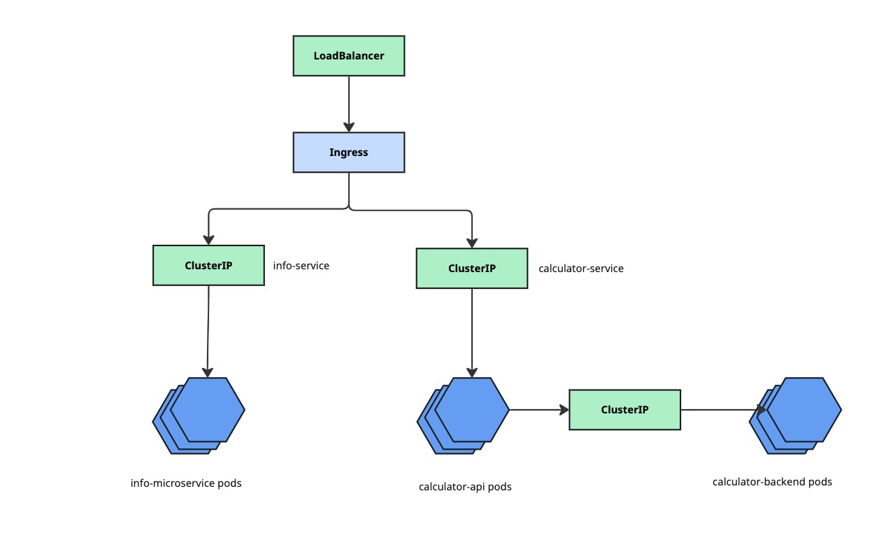

# kubernetes-practice
This is a fun repository to practice using kubernetes with kustomize in microservice environments.

## Overview
Repository consists of one cluster with two microservices deployed across `prod` and `dev` environments:
- API
    - Exposed to end-users via load balancer
    - Provides `/info` and `/engine_version` endpoints that allow client to learn about specific version of microservices withn the cluster
    - Uses environment variables form `ConfigMap`
- Engine
    - Exposed to internal services via ClusterIP
    - Provides `/version` endpoint to learn about engine version

Here's how they look on chart

## How to run this repo
1. Build images (version is your arbitrary choice of app semver, recommended to match `API_VERSION` var from `applications/api/application/main.py` and `ENGINE_VERSION` from `applications/engine/application/main.py`):
    - `docker build -t api:<version> applications/api`
    - `docker build -t engine:<version> applications/engine`
2. Load images to minikube:
    - `minikube load api:<version>`
    - `minikube load engine:<version>`
3. Run dev
    - `make apply-dev`
    - `make expose-dev`
4. Run prod
    - `make apply-prod`
    - `make expose-prod`
5. Make requests (`port` is the tunnel port exposed by `minikube`)
    - `curl -X GET http://127.0.0.1:<port>/info`
    - `curl -X GET http://127.0.0.1:<port>/engine_version`

- remember to add info.api.com and calculator.api.com to /etc/hosts
- remeber to install ingress controller in the cluster `minikube addons enable ingress`
