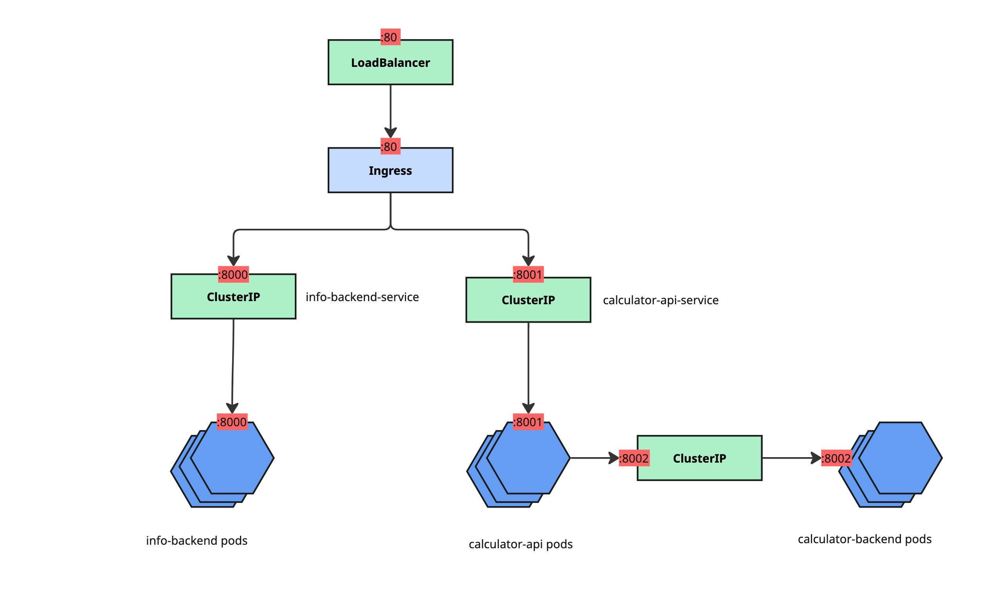

# kubernetes-practice
This is a fun repository to practice using kubernetes with kustomize in microservice environments.

## Overview
Repository consists of one cluster with three microservices deployed across `prod` and `dev` environments:
- Info Backend
    - provides dummy information about the application
    - parametized by `INFO_BACKEND_ENV` env variable that has different values per env
- Calculator API
    - proxy for calculator backend
    - uses service to send requests to `Calculator backend`
    - user can send the list of numbers to `/add` endpoint to get the sum of all numbers
- Calculator backend
    - service that does the actual calculations
    - receives requests from `Calculator API` and responds with sum

Here's how they look on chart

## How to run this repo
0. Install ingress controller in the cluster
    - `minikube addons enable ingress`
1. Update your `/etc/hosts` so that you have domains pointed to localhost
    - `127.0.0.1       localhost dev.info.api.com dev.calculator.api.com prod.info.api.com prod.calculator.api.com`
2. Build images:
    - `make build`
3. Load images to minikube:
    - `make load`
4. Run both environments
    - `make apply-dev`
    - `make apply-prod`
5. Run load balancer that sends traffic to ingress
    - `make apply-lb`
6. Expose load balancer
    - `make expose`
7. Send requests
    - `curl -X GET dev.info.api.com` => should respond with `ENV=development`
    - `curl -X GET prod.info.api.com` => should respond with `ENV=production`
